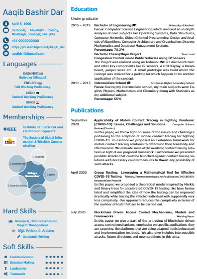
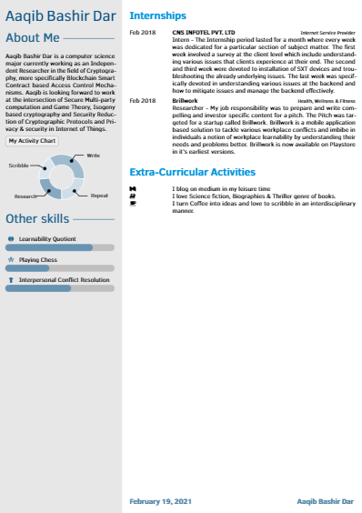

  <h1> Curriculum-Vitae-using-LaTeX </h1>

This repository contains the code for Curriculum Vitae and the related files needed to build and run this code.

  <h1> Working through the Code </h1>

Since LaTeX offers WYSIWYG(What you see is what you get), it shouldn't be hard to fork this repository or download the code and follow the same directory structure as is in this github repository to avoid any unnecessary mismatch path errors. The Code can be worked on either in offline mode or in the online editor Overleaf.

  <h2> Curriculum-Vitae See Through</h2>

  <h3> Curriculum-Vitae Front </h3>
 

 

  <h3> Curriculum-Vitae Back </h3>

